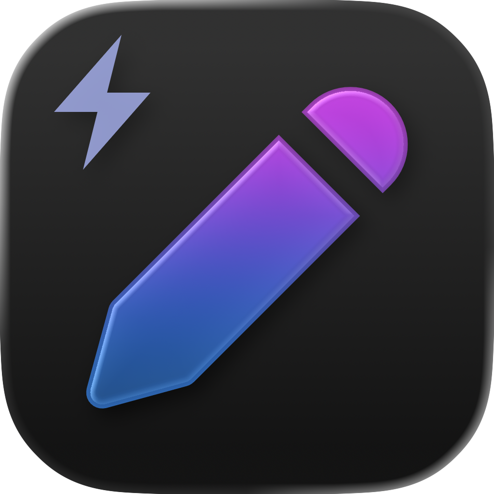

<p align="center">
  
</p>

# Noter: A Multimodal Note-taking Assistant

**Built at Cal Hacks 12.0 (October 24–26, 2025)**  
**Authors:** Daniel Grant, Haoming Chen, Miranda Anna Christ

---

## Overview

Noter is a modern iOS application built with SwiftUI and SwiftData. It organizes classes and lectures, generates study notes from recorded audio or uploaded slides, and supports AI-based learning tools such as flashcards, multiple-choice questions, and summaries.  

The app was originally designed for Cal Hacks 12.0, hosted by Hack Berkeley, and focuses on simplicity, data integrity, and a clean, glass-inspired user interface consistent with iOS 17+ design language.

---

## Project Structure

```
Models/
├─ StudyClass.swift
├─ Lecture.swift
├─ LectureAttachment.swift
├─ LectureNote.swift
└─ UserProfile.swift

Views/
├─ RootTabView.swift
├─ Classes/
│ ├─ ClassesListView.swift
│ ├─ ClassCardView.swift
│ ├─ ClassDetailView.swift
│ ├─ LectureDetailView.swift
│ └─ AddEditClassView.swift
├─ Learn/
│ ├─ LearnHomeView.swift
│ ├─ FlashcardsView.swift
│ ├─ MCQPracticeView.swift
│ └─ SummariesView.swift
└─ Settings/
├─ SettingsView.swift
└─ CreateAccountView.swift

Tests/
├─ Unit tests for create/update/delete
└─ Basic UI test covering add and navigation flow
```


---


## Core Features

### Data Layer
- Built on SwiftData using `@Model` types.
- A `StudyClass` owns multiple `Lecture` instances, each lecture containing notes and attachments.
- Lectures can include audio references or slide URLs for future AI analysis.
- Provides computed helpers such as `sortedLectures` and mock data factories for previews and testing.

### Root Interface
- Three-tab structure: **Classes**, **Learn**, and **Settings**.
- Uses `NavigationStack`, `Observation`, and modern SwiftUI conventions.
- Background materials use `.ultraThinMaterial` for subtle glass effects.

### Classes Tab
- Displays an adaptive layout (List on compact width, Grid on larger screens).
- Supports adding, editing, and deleting classes through sheets and context menus.
- Includes detailed lecture timelines, a quick note composer, and toolbar actions.
- Lecture detail pages support note editing and a stubbed “Analyze with AI” button.

### Learn Tab
- Segmented interface with Flashcards, MCQ Practice, and Summaries.
- Accepts filters for the selected class or lecture.
- Uses placeholder async tasks and mock data for now.
- Ready for AI integration to generate study materials.

### Settings Tab
- Profile management (name and avatar placeholder).
- AI configuration with model picker and secure API key input.
- Sync section with iCloud toggle and export button.
- Study preferences with sliders and toggles for reminders and note length.
- Inline comments mark future integration points.

### Account and Profile
- Simple create-account page captures user information and persists via `UserProfile`.
- Data integrates with the Settings and Classes tabs.

### Testing and Previews
- All previews use `.modelContainer(for:inMemory:)` with seeded mock data.
- Unit tests cover core model operations.
- A UI test verifies creating a class and navigating between tabs.

---

## Development Notes

- The “Analyze with AI” and “Regenerate” actions are stubbed to indicate where to integrate real APIs (e.g., OpenAI, Anthropic, or Azure endpoints).
- Sync and export actions can later tie into CloudKit or custom JSON/Markdown share logic.
- API keys should be stored securely in the keychain when implemented.
- The architecture is ready for SwiftData + CloudKit syncing when available.

---

## Getting Started

1. Use Xcode 26 or newer, targeting iOS 26 or later.  
2. Clone the repository and open the project in Xcode.  
3. Build and run on a simulator or device.  
4. Create a profile on the login screen.  
5. Add a class, lectures, and notes from the Classes tab.  
6. Explore the Learn tab for practice views.  
7. Adjust preferences and API settings from the Settings tab.

---

## Future Work

- Integrate AI endpoints for note generation and flashcard creation.  
- Enable file upload and in-app audio recording for lectures.  
- Implement iCloud/CloudKit synchronization.  
- Add data export to share notes and summaries.  
- Extend authentication beyond local profiles.  
- Add animations, theme support, and improved visual polish.

---

## Cal Hacks 12.0 Context

Noter was developed during **Cal Hacks 12.0**, held at the Palace of Fine Arts in San Francisco.  
The project was designed in the spirit of building practical educational tools within a hackathon environment, balancing clean architecture with creative flexibility.  
Thanks to Hack Berkeley and the Cal Hacks organizers for hosting the event.

---

## License

Released under the MIT License.  
You are free to use, extend, and modify this project with attribution.
